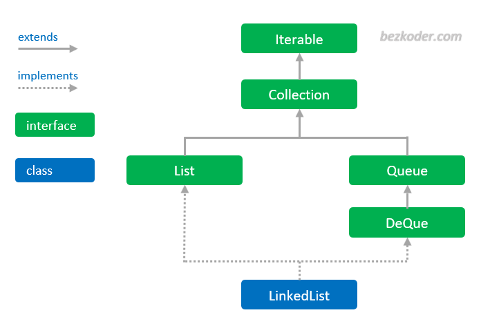

# Queue

## Overview

A Queue is just like a queue in real-life. It’s a First In First Out (FIFO) data structure. New elements will be added at the back and removed from the front.

-   Adding an element at the back is called Enqueue.
-   Removing an element from the front is called Dequeue.

Kotlin Queue interface which is part of Collections framework. Diagram below shows hierarchy of Queue interface in Collections.

You can see that the Queue is just an interface, so we need a concrete implementation.
LinkedList class implements the Queue interface => we can use it as a Queue.
